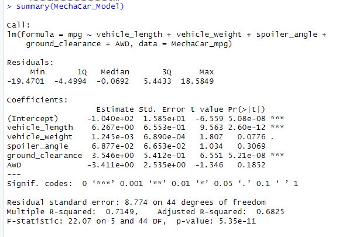
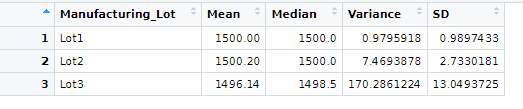
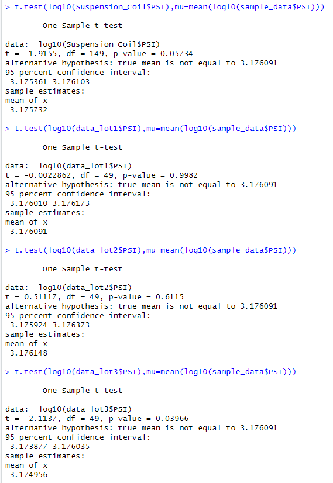

# MechaCar_Statistical_Analysis

## Linear Regression to Predict MPG

After this Linear Regression we can get the linear regression model between mpg and other coefficients.

According to the top, we know that 71% of the variability observed in the target variable is explained by the regression model because the R-squared is 0.7149, We also know that vehicle_weight has 0.0776 of p-value which mean that 5% of the time you would see a test statistic at least as extreme as the one you found if the null hypothesis was true.

*Which variables/coefficients provided a non-random amount of variance to the mpg values in the dataset?

The answer is vehicle_length and ground_clearance, beacuse their p-value are small.

*Is the slope of the linear model considered to be zero? Why or why not?

The answer should be no, because if the moudel considered the slope as zero then the R-squared of this model shouldn't be that high.

*Does this linear model predict mpg of MechaCar prototypes effectively? Why or why not?

The answer is yes, because the R-squared is 0.71 which mean that 71% of the variability observed in the target variable is explained by the regression model.

## Summary Statistics on Suspension Coils

Accroding to the top we know that the Mean of each Lot is around 1500 but Lot3 has the biggest variance which mean compare to Lot1 and Lot2, the PSI of Lot3 is more unstable.

*The design specifications for the MechaCar suspension coils dictate that the variance of the suspension coils must not exceed 100 pounds per square inch. Does the current manufacturing data meet this design specification for all manufacturing lots in total and each lot individually? Why or why not?

The total of manufacturing lots and Lot1 and Lot2 are obey the design specification, on the other hand, Lot3 is not follow the specification because its variance is greater than 100.

## T-Tests on Suspension Coils

According to the top we can say that Assuming our significance level was the common 0.05 percent those p-value except the p-value of Lot3 are above our significance level. Therefore, we do not have sufficient evidence to reject the null hypothesis.

## Study Design: MechaCar vs Competition
*What metric or metrics are you going to test?
In my opinion, ground clearance and spoiler angle are worth to test, because those metrics relate to safety and there are many specifications to follow.

*What is the null hypothesis or alternative hypothesis?
In this case we want to make sure every cars' are followed specification of ground clearance, so the null hypothesis will be there is no statistical difference between the MechaCar ground clearance  mean and specification mean.

*What statistical test would you use to test the hypothesis? And why?
I would like to ues one-sample t-test to test the hypothesis, because the dataset isn't large so we don't need z-test and it test between MechaCar ground clearance and presumed population mean, so we don't use two-sample t-test.

*What data is needed to run the statistical test?
We need all ground clearance data from MechaCar_mpg.csv as sample data and all ground clearance data that equal to specification as presumed population data